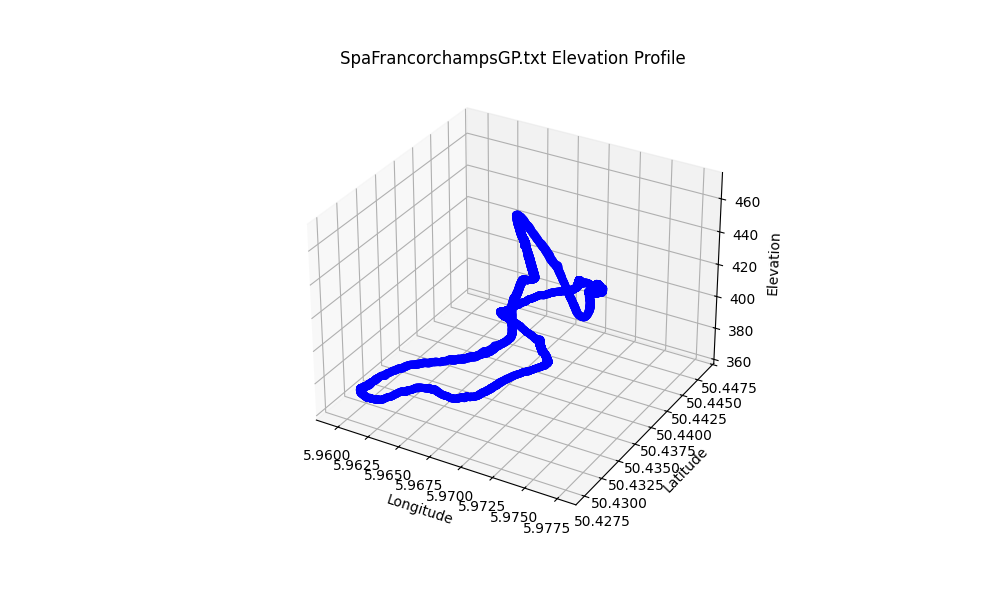
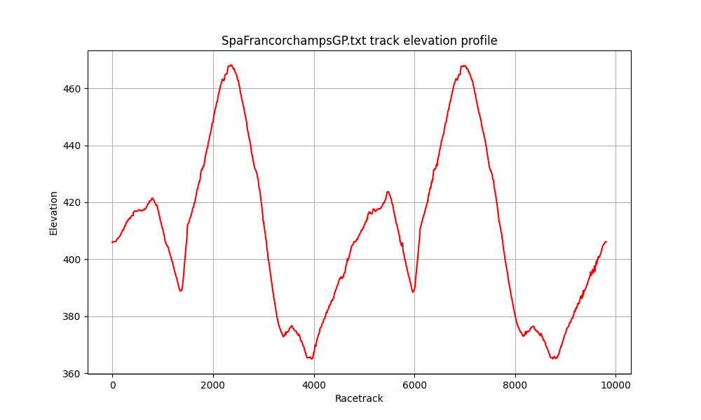

# Interpolation-of-Race-Track-Elevations

### PL:
Zaimplementowałam metody interpolacji Lagrange'a oraz funkcji sklejanych trzeciego stopnia do analizy profilu wysokościowego różnych torów wyścigowych. Wykorzystałam dane z Google Maps Elevation API dla torów takich jak Monza, Spa-Francorchamps, Marina Bay, Silverstone i Mugello, tworząc wykresy wysokościowe oraz wykresy 3D dla lepszej wizualizacji zmian wysokości na trasach.

### ENG:
I implemented Lagrange's interpolation and cubic spline methods to analyze the elevation profiles of various race tracks. Using data from Google Maps Elevation API for tracks such as Monza, Spa-Francorchamps, Marina Bay, Silverstone, and Mugello, I created elevation charts and 3D plots to visually represent altitude changes along these tracks.

